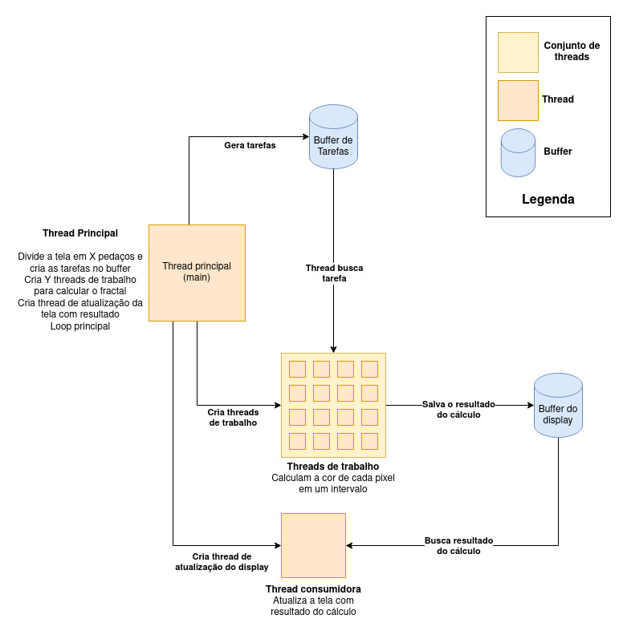

# Fractal de Mandelbrot 

Esta aplicação tem como objetivo calcular o fractal de mandelbrot de forma paralela (usando pthreads) e apresentá-lo na tela (usando libX).

## Funcionamento Básico

A estrutura da aplicação pode está representada no diagrama abaixo.

### Thread Principal

A thread principal é responsável por dividir a tela disponível em diversas partes e salvar cada pedaço (ponto inicial e final) num *buffer de tarefas*. Após a divisão, ela deve criar um número de **threads de trabalho** e uma **thread de atualização da tela**.

### Thread de Trabalho

As threads de trabalho são responsáveis por obter uma tarefa do buffer e calcular a cor de cada pixel especificado na tarefa. Ao finalizar o cálculo a thread deve salvar o resultado no *buffer do display* e procurar por uma nova tarefa no *buffer de tarefas*. Se houver uma nova tarefa, deve repetir o processo, caso contrário, deve ser encerrada.

### Thread de atualização da tela

A thread de atualização da tela é responśavel por obter o resultado do cálculo do *buffer do display* e caso haja algum resultado para ser exibido ela atualizará a tela de acordo com as coordenadas especificadas. Caso contrário, esta thread deve ficar em IDLE até que haja algum item no *buffer do display*.

Para que não seja feita uma espera ativa, esta thread faz a espera usando uma variável de condição. Esta variável de condição é sinalizada pelas **threads de trabalho** sempre que um cálculo é finalizado.

# Resultado esperado

# Referências 

* Material das aulas de Processamento de Alto Desempenho
* [Algoritmo (sequencial) responsável por calcular o fractal](http://www.cs.nthu.edu.tw/~ychung/homework/para_programming/seq_mandelbrot_c.htm)
* [Let’s draw the Mandelbrot set!](https://jonisalonen.com/2013/lets-draw-the-mandelbrot-set/)
* [Wikipedia - Mandelbrot set](https://en.wikipedia.org/wiki/Mandelbrot_set)
* [Man pages - pthread](https://man7.org/linux/man-pages/man7/pthreads.7.html)
* [The XLib Manual](https://tronche.com/gui/x/xlib/)